# rRunAI Architecture

**Version 1.0 — Canonical technical architecture**

This document is the technical authority for how rRunAI is structured, what exists today, and how future systems should be built. It must align with [`PRODUCT_BIBLE.md`](PRODUCT_BIBLE.md), which governs product intent. [`AGENTS.md`](../AGENTS.md) governs implementation safety rules.

Every AI agent and engineer must read the Product Bible and this document before modifying architecture, adding engines, or changing data flows.

---

## Status legend

| Status | Meaning |
|--------|---------|
| **Shipped** | Exists in the codebase and is functional today |
| **In progress** | Partially implemented or placeholder present |
| **Direction (not built)** | Architectural boundary or future design; not a commitment to build without scoped approval |

---

## 1. Architecture principles

These principles derive from the Product Bible and govern all technical decisions.

### 1.1 Separation of concerns

Sensor collection, workout state, coaching decisions, voice delivery, and presentation must remain separate layers. No single React component or hook should own the full coaching loop.

| Layer | Responsibility | Must not own |
|-------|----------------|--------------|
| Sensors | Collect and filter device data | Coaching decisions, UI layout |
| Workout state | Block progression, session structure | GPS processing, voice output |
| Coaching decisions | Interpret effort vs intent; produce cues | Speech synthesis, screen rendering |
| Voice delivery | Speak cues with priority and cooldown | Pace calculation, block timing |
| Presentation | Screens and glanceable UI | Business logic for coaching |

**Shipped** — this separation exists in the current hook and service layout.

### 1.2 Decision to coach ≠ mechanism that speaks

Coaching logic produces a decision (`CoachingFeedback`: message + state). Voice hooks consume that decision independently. This boundary enables a future Python coaching brain to produce decisions without rewriting voice delivery.

**Shipped** — `useCoaching.ts` → `useVoiceCoach.ts` / `useBlockTransitionVoice.ts`.

### 1.3 Local-first, safety-critical on device

The active run must function without network connectivity. Block progression, GPS processing, transition timing, and essential voice cues run entirely on-device.

**Shipped** — no network dependencies in the run loop.

### 1.4 Deterministic where timing and safety matter

Block transitions, pace threshold comparisons, GPS filtering, and voice priority rules use deterministic logic. Non-deterministic interpretation (LLM / Python brain) is reserved for pre-run conversation, post-run reflection, and nuanced coaching phrasing — never for safety-critical timing.

**Shipped** for deterministic layer; **Direction (not built)** for LLM layer.

### 1.5 Typed, serializable boundaries

All coaching inputs and outputs, athlete context, and engine interfaces must be explicit TypeScript types serializable to JSON. This prepares for Python coaching brain handoff without rewriting the mobile app.

**Shipped** for current types (`Session`, `WorkoutBlock`, `CoachingFeedback`, `BlockProgress`, `RunLocationSnapshot`). **Direction (not built)** for athlete model and coaching decision protocol.

### 1.6 Modality follows context

Pre-run and post-run: conversation-first (text initially). During run: voice-first with glanceable screen. Architecture must not force conversational UI during physical effort or voice interaction during planning/reflection.

**Shipped** for during-run voice-first. **Direction (not built)** for pre/post conversation.

### 1.7 Graceful degradation

Missing GPS, calibrating pace, denied permissions, speech failures, and (future) missing heart rate must not crash or block a run.

**Shipped** for GPS and speech. **Direction (not built)** for heart-rate fallback.

### 1.8 Testability

Deterministic engines must be testable with fixture data. GPS, pace, deduplication, transition messages, and formatters have unit tests.

**Shipped** — `tests/pace.test.ts`, `tests/sampleDeduper.test.ts`, `tests/locationSourceGate.test.ts`, `tests/runGpsDiagnostics.test.ts`, `tests/transitionMessages.test.ts`, `tests/formatters.test.ts`.

### 1.9 Explainability and auditability

Coaching decisions must be traceable to inputs: block type, pace target, sensor values, session structure. Future LLM decisions must log structured rationale, not opaque outputs.

**Shipped** for deterministic coaching (state machine is fully inspectable). **Direction (not built)** for LLM audit trail.

### 1.10 Retain and extend; do not rewrite

Existing shipped engines (GPS pipeline, block engine, voice delivery, coaching rules) are foundational. New engines compose around them; they are not replaced by LLM or backend services.

See §20.

---

## 2. Current mobile architecture

### 2.1 Stack

| Component | Technology | Status |
|-----------|------------|--------|
| Language | TypeScript | **Shipped** |
| UI | React 19 | **Shipped** |
| Mobile | React Native 0.83 | **Shipped** |
| Platform | Expo SDK 55 | **Shipped** |
| Navigation | React Navigation (native stack) | **Shipped** |
| GPS | `expo-location` + TaskManager background task | **Shipped** |
| Speech | `expo-speech` | **Shipped** |
| Native | iOS and Android projects alongside Expo | **Shipped** |
| Package manager | npm + `package-lock.json` | **Shipped** |

### 2.2 Application structure

```text
rRunAI/
├── App.tsx                              # Root component
├── index.ts                             # Expo registration
├── app/
│   ├── hooks/                           # React hooks (orchestration + thin adapters)
│   │   ├── useLocation.ts               # GPS lifecycle
│   │   ├── useWorkoutBlocks.ts          # Block engine
│   │   ├── useCoaching.ts               # Pace coaching decisions
│   │   ├── useVoiceCoach.ts             # Pace voice delivery
│   │   └── useBlockTransitionVoice.ts   # Transition voice delivery
│   ├── services/                        # Device integrations + processing (no React)
│   │   ├── runLocationTracking.ts       # GPS orchestration, pub/sub
│   │   ├── runLocationState.ts          # RunLocationProcessor
│   │   ├── locationSourceGate.ts      # Foreground/background gating
│   │   ├── sampleDeduper.ts           # Duplicate sample rejection
│   │   └── runGpsDiagnostics.ts       # Diagnostics tracker
│   ├── screens/                         # Presentation
│   │   ├── HomeScreen.tsx
│   │   ├── RunScreen.tsx
│   │   └── SummaryScreen.tsx
│   ├── navigation/
│   │   └── AppNavigator.tsx
│   ├── types/
│   │   └── session.ts                   # Session, WorkoutBlock, catalogue
│   └── utils/
│       ├── pace.ts                      # Pace algorithms
│       ├── formatters.ts                # Display formatting
│       └── transitionMessages.ts        # Block transition message builder
├── tests/                               # Unit tests for deterministic logic
├── android/
└── ios/
```

`app/components/` exists but is empty. Presentation logic currently lives in screens.

### 2.3 Navigation and screen params

**Shipped** — `AppNavigator.tsx` defines typed navigation:

```typescript
type RootStackParamList = {
  Home: undefined;
  Run: { session: Session };
  Summary: {
    elapsedSeconds: number;
    distanceKm: number;
    session: Session;
    diagnostics?: RunLocationDiagnostics;
  };
};
```

Session object flows Home → Run → Summary. No persistent storage; run data passes via navigation params only.

### 2.4 RunScreen composition (during-run orchestration)

**Shipped** — `RunScreen.tsx` composes six on-device systems:

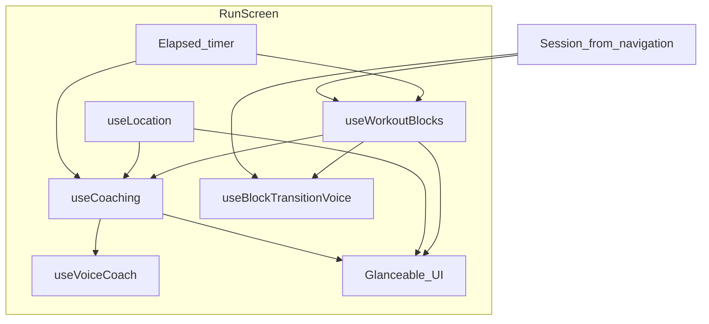

| System | Hook / module | Status |
|--------|---------------|--------|
| Elapsed timer | `useState` + `useEffect` in RunScreen | **Shipped** |
| GPS tracking | `useLocation` | **Shipped** |
| Block progression | `useWorkoutBlocks` | **Shipped** |
| Pace coaching | `useCoaching` | **Shipped** |
| Pace voice | `useVoiceCoach` | **Shipped** |
| Transition voice | `useBlockTransitionVoice` | **Shipped** |
| Auto-complete | `useEffect` in RunScreen | **Shipped** |
| Completion voice | Inline `Speech.speak` in RunScreen | **Shipped** |

Structured sessions use all systems. Free Run (`blocks: []`) uses timer + GPS only.

### 2.5 What does not exist yet

| System | Status |
|--------|--------|
| Global state management (Redux, Zustand, etc.) | Not present |
| Persistent storage / database | Not present |
| Backend API client | Not present |
| BLE / heart-rate service | **Direction (not built)** |
| Conversation UI or chat service | **Direction (not built)** |
| Python coaching service client | **Direction (not built)** |

---

## 3. Conversation-first orchestration model

### 3.1 Purpose

The orchestration model coordinates the three interaction modes defined in the Product Bible:

| Mode | When | Primary interface | Status |
|------|------|-------------------|--------|
| Pre-run | Before the run | Conversation-first | **Direction (not built)** |
| During run | Active run | Voice-first | **Shipped** |
| Post-run | After the run | Conversation-first | **Direction (not built)** |

### 3.2 Target architecture

**Direction (not built)** — a future `CoachingOrchestrator` (name TBD) routes between engines based on app phase:

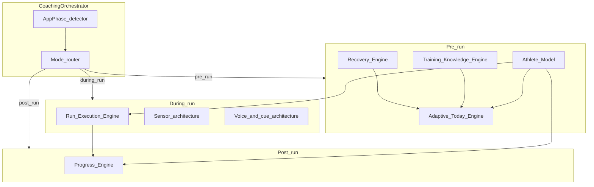

The orchestrator:

- Reads and writes the **Athlete Model** as shared context.
- Selects the active interaction mode and delegates to the correct engine(s).
- Ensures during-run mode never blocks on network or LLM latency.
- Passes structured outputs between engines (not raw UI state).

### 3.3 What exists today

**Shipped** — minimal orchestration:

| Phase | Orchestrator today | Status |
|-------|-------------------|--------|
| Pre-run | `HomeScreen` — session picker, `getTodaySession()` stub | **Shipped** (picker); **In progress** (today selection stub) |
| During run | `RunScreen` — hook composition | **Shipped** |
| Post-run | `SummaryScreen` — stats display, RPE placeholder | **Shipped** (stats); **In progress** (RPE placeholder) |

No central orchestrator exists. Navigation stack provides phase transitions only.

### 3.4 Orchestration rules (permanent)

1. During-run orchestration is synchronous and on-device. **Shipped**
2. Pre-run and post-run orchestration may invoke LLM/backend asynchronously. **Direction (not built)**
3. Mode transitions are explicit: Home → Run → Summary. No hidden mode switching. **Shipped**
4. Athlete Model is the single shared context across modes. **Direction (not built)**
5. Run Execution Engine owns the active run; orchestrator does not interfere mid-run. **Shipped** (implicit — RunScreen is isolated)

---

## 4. Recovery Engine

### 4.1 Purpose

Inform pre-run planning with recovery-aware guidance. Assesses whether the runner is ready for the planned stimulus and whether the session should be adjusted — through conversation, not a standalone dashboard score.

Aligns with Product Bible §15 (Daily Readiness Philosophy).

### 4.2 Status: **Direction (not built)**

No `RecoveryEngine` module exists. Recovery is represented only structurally in workout design:

| Recovery concept | Implementation today | Status |
|-----------------|---------------------|--------|
| Recovery blocks in workouts | `BlockType: "recovery"` in session catalogue | **Shipped** |
| Silent coaching during recovery | `useCoaching` returns null when no pace target | **Shipped** |
| Age-aware recovery philosophy | Documented in Product Bible | **Direction (not built)** as engine |
| Readiness conversation | Pre-run conversation-first mode | **Direction (not built)** |
| HRV / sleep / readiness score | — | **Direction (not built)** |
| Automated workout downgrade | — | **Direction (not built)** |

### 4.3 Target responsibilities (future)

- Consume Athlete Model inputs: recent session load, subjective feedback (RPE), age-aware recovery windows.
- Produce recovery signals for Adaptive Today Engine (e.g., "suggest easy run", "reduce interval count").
- Never override runner judgment — output recommendations, not commands.
- Operate in pre-run conversation mode only; never interrupt during-run voice.

### 4.4 Interface sketch (future)

```typescript
// Direction (not built) — illustrative only
interface RecoverySignal {
  readinessLevel: "high" | "moderate" | "low" | "unknown";
  recommendation: string;          // human-readable, for conversation
  suggestedAdjustments: SessionAdjustment[];
  inputsUsed: string[];            // auditability
}
```

---

## 5. Adaptive Today Engine

### 5.1 Purpose

Determine what the runner should do today — session selection, target adjustments, and plan adaptations — informed by Recovery Engine, Training Knowledge Engine, and Athlete Model.

### 5.2 Status: **In progress** (stub) / **Direction (not built)** (full engine)

| Capability | Implementation | Status |
|------------|----------------|--------|
| Session catalogue | `SESSION_CATALOGUE` in `session.ts` | **Shipped** |
| Session picker UI | `HomeScreen` | **Shipped** |
| Default today session | `getTodaySession()` returns `SESSION_CATALOGUE[0]` (Easy Run) | **In progress** — hardcoded stub |
| Readiness-informed selection | — | **Direction (not built)** |
| Conversational planning | — | **Direction (not built)** |
| Session modification (adjust blocks/targets) | — | **Direction (not built)** |

### 5.3 Target responsibilities (future)

- Receive Recovery Engine signals and Athlete Model context.
- Query Training Knowledge Engine for valid session options.
- Produce today's recommended session (or modifications to a planned session).
- Present recommendation through pre-run conversation-first interface.
- Output a `Session` object compatible with Run Execution Engine.

### 5.4 Interface sketch (future)

```typescript
// Direction (not built) — illustrative only
interface TodayPlan {
  recommendedSession: Session;
  rationale: string;
  adjustments: SessionAdjustment[];
  alternatives: Session[];
  inputsUsed: string[];
}
```

### 5.5 Current stub

```typescript
// app/types/session.ts — Shipped
export function getTodaySession(): Session {
  return SESSION_CATALOGUE[0]; // Always Easy Run
}
```

This stub must be replaced by Adaptive Today Engine logic, not scattered across screens.

---

## 6. Athlete Model

### 6.1 Purpose

A typed, serializable representation of runner context shared across all engines and interaction modes. The single source of truth for who the runner is, how they have been training, and what they have communicated.

Aligns with Product Bible §13.

### 6.2 Status: **Direction (not built)**

No athlete model store exists. Runner context is implicit and ephemeral:

| Data | Storage today | Status |
|------|---------------|--------|
| Selected session | Navigation param | **Shipped** (ephemeral) |
| Run results (duration, distance, pace) | Navigation param to Summary | **Shipped** (ephemeral) |
| GPS diagnostics | Navigation param to Summary | **Shipped** (ephemeral) |
| Session history | — | **Direction (not built)** |
| RPE / subjective feedback | — | **In progress** (placeholder on Summary) |
| Heart-rate zones | — | **Direction (not built)** |
| Age / preferences | — | **Direction (not built)** |
| Conversation history | — | **Direction (not built)** |

### 6.3 Target structure (future)

```typescript
// Direction (not built) — illustrative only
interface AthleteModel {
  profile: {
    ageRange?: string;
    experienceLevel?: string;
    preferences: AthletePreferences;
  };
  physiology: {
    hrZones?: HeartRateZones;
    paceTargets?: PaceTargetProfile;
  };
  recentHistory: {
    sessions: CompletedSessionSummary[];
    lastRpe?: number;
    recentLoad?: TrainingLoadSummary;
  };
  conversation: {
    lastPreRunCheckIn?: CheckInSummary;
    lastPostRunReflection?: ReflectionSummary;
  };
  updatedAt: string; // ISO timestamp
}
```

### 6.4 Design requirements

- Serializable to JSON for Python coaching brain handoff.
- Graceful degradation when fields are missing.
- Must not block the run loop — Run Execution Engine operates with or without full model.
- Not a medical record or social profile.
- Coaching decisions must cite which model fields were used (auditability).

### 6.5 Storage direction

**Direction (not built)** — local persistent storage on device initially (e.g., file-based or SQLite). Backend sync only with scoped approval. During MVP, prefer local-first athlete model with no cloud dependency.

---

## 7. Training Knowledge Engine

### 7.1 Purpose

Own structured training knowledge: session templates, block types, pace targets, workout taxonomy, and training principles. Provides valid session definitions to Adaptive Today Engine and Run Execution Engine.

### 7.2 Status: **Shipped** (static catalogue) / **Direction (not built)** (dynamic engine)

| Capability | Implementation | Status |
|------------|----------------|--------|
| Block types | `BlockType` in `session.ts` | **Shipped** |
| Session templates | `SESSION_CATALOGUE` | **Shipped** |
| Per-block pace targets | `WorkoutBlock.targetMinPace/MaxPace` | **Shipped** |
| Transition message rules | `transitionMessages.ts` | **Shipped** |
| Dynamic session generation | — | **Direction (not built)** |
| Personalized pace targets | — | **Direction (not built)** |
| Training principle rules | Product Bible §17; `TRAINING_PRINCIPLES.md` reserved | **Direction (not built)** as engine |
| Distance-based blocks | — | **Direction (not built)** |

### 7.3 Shipped session catalogue

| Session ID | Blocks | Work pace target |
|------------|--------|------------------|
| `easy_run` | 2m warm-up → 10m easy → 2m cool-down | 6:00–7:00 /km |
| `threshold_run` | 3m warm-up → 3m threshold → 2m recovery → 3m threshold → 3m cool-down | 4:50–5:05 /km |
| `interval_run` | 3m warm-up → 3×(1m interval + 1m recovery) → 3m cool-down | 4:20–4:35 /km |
| `free_run` | No blocks | None |

### 7.4 Target responsibilities (future)

- Validate session definitions (block sequences, target ranges).
- Generate modified sessions (e.g., reduce interval count) from templates.
- Apply training principles when Adaptive Today Engine requests alternatives.
- Remain deterministic for template lookup; LLM may suggest but not invent invalid structures.

### 7.5 Interface sketch (future)

```typescript
// Direction (not built) — illustrative only
interface TrainingKnowledgeEngine {
  getCatalogue(): Session[];
  getSession(id: string): Session | null;
  applyAdjustments(session: Session, adjustments: SessionAdjustment[]): Session;
  validateSession(session: Session): ValidationResult;
}
```

Today, `SESSION_CATALOGUE` and helper functions in `session.ts` serve as the static implementation.

---

## 8. Progress Engine

### 8.1 Purpose

Track training progress across sessions. Capture completed run summaries, subjective feedback, and adaptation signals. Feed the Athlete Model and inform future Adaptive Today and Recovery Engine decisions.

Aligns with Product Bible post-run conversation-first mode and cross-session adaptation.

### 8.2 Status: **Direction (not built)**

| Capability | Implementation | Status |
|------------|----------------|--------|
| Post-run stats display | `SummaryScreen` | **Shipped** (current run only) |
| Completed blocks list | `SummaryScreen` | **Shipped** (current run only) |
| GPS diagnostics display | `SummaryScreen` | **Shipped** (current run only) |
| RPE capture | Summary placeholder | **In progress** |
| Session history persistence | — | **Direction (not built)** |
| Progress trends | — | **Direction (not built)** |
| Post-run learning signals | — | **Direction (not built)** |
| Cross-session adaptation | — | **Direction (not built)** |

### 8.3 Target responsibilities (future)

- Persist `CompletedSessionSummary` after each run.
- Capture RPE and conversational reflection (post-run mode).
- Compute simple progress signals (sessions completed, recent load) for Recovery Engine.
- Update Athlete Model `recentHistory`.
- Never compete with dedicated analytics platforms (per Product Bible scope).

### 8.4 Interface sketch (future)

```typescript
// Direction (not built) — illustrative only
interface CompletedSessionSummary {
  sessionId: string;
  sessionName: string;
  startedAt: string;
  elapsedSeconds: number;
  distanceKm: number;
  averagePaceMinPerKm: number | null;
  blocksCompleted: WorkoutBlock[];
  rpe?: number;
  diagnostics?: RunLocationDiagnostics;
}

interface ProgressEngine {
  recordSession(summary: CompletedSessionSummary): void;
  getRecentSessions(count: number): CompletedSessionSummary[];
  getProgressSignals(): ProgressSignals;
}
```

### 8.5 Current data flow (ephemeral)

Run ends → navigation params carry `elapsedSeconds`, `distanceKm`, `session`, `diagnostics` → Summary displays → **Done** → data discarded.

**Shipped** for display. **Direction (not built)** for persistence and learning.

---

## 9. Run Execution Engine

### 9.1 Purpose

Execute a structured or free run on-device: timer, block progression, sensor integration, coaching decisions, voice cues, auto-complete, and navigation to Summary.

This is the most mature engine in the codebase.

### 9.2 Status: **Shipped**

### 9.3 Components

| Component | Module | Responsibility | Status |
|-----------|--------|----------------|--------|
| Session input | Navigation param `Session` | Workout definition | **Shipped** |
| Elapsed timer | `RunScreen` | 1-second counter from mount | **Shipped** |
| Block engine | `useWorkoutBlocks` | Time-based block progression | **Shipped** |
| Coaching decisions | `useCoaching` | Pace vs block target (8s interval) | **Shipped** |
| Transition messages | `transitionMessages.ts` | Context-aware block transition text | **Shipped** |
| Transition voice | `useBlockTransitionVoice` | Speak transitions (priority) | **Shipped** |
| Pace voice | `useVoiceCoach` | Speak pace cues (25s cooldown) | **Shipped** |
| Completion flow | `RunScreen` | Speak, wait 3s, stop GPS, navigate | **Shipped** |
| Manual end | `RunScreen` | End Run anytime | **Shipped** |
| Glanceable UI | `RunScreen` | Pace, distance, time, block, banner | **Shipped** |
| Pause / resume | — | — | **Direction (not built)** |
| Distance-based blocks | — | — | **Direction (not built)** |
| Heart-rate coaching | — | — | **Direction (not built)** |
| Runner voice commands | — | — | **Direction (not built)** |

### 9.4 Block engine detail

**Shipped** — `useWorkoutBlocks(blocks, elapsedSeconds)`:

- Pre-computes cumulative end times from `durationSec`.
- Returns `activeBlock`, `blockIndex`, `blockTimeRemaining`, `totalBlocks`, `isWorkoutComplete`, `didBlockChange`.
- Time-based only; elapsed seconds drive all transitions.

### 9.5 Coaching decision detail

**Shipped** — `useCoaching(elapsed, displayPace, targetMinPace, targetMaxPace)`:

| Input | Source |
|-------|--------|
| `elapsedSeconds` | RunScreen timer |
| `currentPaceMinPerKm` | `useLocation` display pace |
| `targetMinPace/MaxPace` | `activeBlock` from `useWorkoutBlocks` |

| Output state | Message |
|--------------|---------|
| `too_fast` | "Slow down slightly" |
| `too_slow` | "Pick it up a bit" |
| `on_target` | "Good pace, keep it steady" |
| `null` | Silent (no target or no pace) |

### 9.6 Execution flow

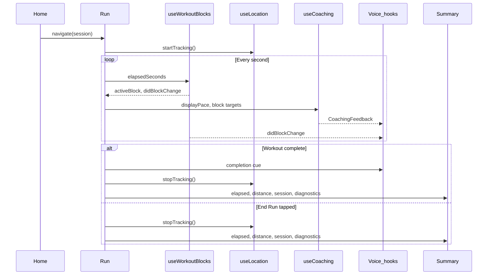

---

## 10. Voice and coaching cue architecture

### 10.1 Purpose

Deliver spoken coaching cues during the run with correct priority, cooldown, and failure handling. Separate decision production from speech synthesis.

### 10.2 Status: **Shipped**

### 10.3 Architecture

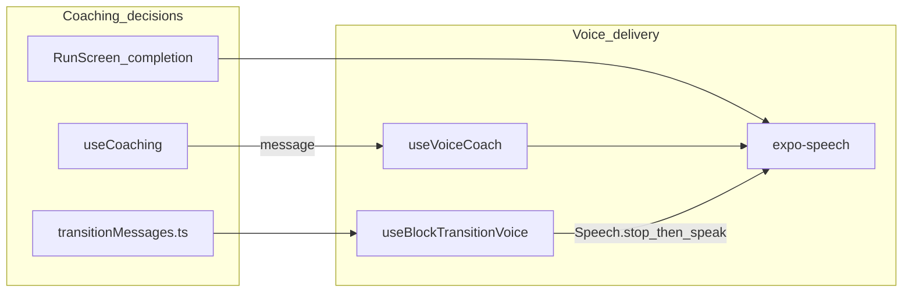

### 10.4 Voice paths

| Path | Trigger | Cooldown | Priority | Status |
|------|---------|----------|----------|--------|
| Pace cues | `CoachingFeedback.message` changes | 25 seconds; queue latest | Normal | **Shipped** |
| Block transitions | `didBlockChange` (skip index 0) | None | Highest — stops current speech | **Shipped** |
| Workout completion | `isWorkoutComplete` | One-shot | High — stops current speech | **Shipped** |

### 10.5 Pace voice rules (`useVoiceCoach`)

**Shipped**:

- Speak only when message changes to a new non-null value.
- 25-second cooldown between spoken pace messages.
- During cooldown: queue latest message; discard stale queued messages.
- Speech rate: 1.05.
- try/catch on all `Speech.speak()` calls.
- Cleanup on unmount: `Speech.stop()`, clear timers.

### 10.6 Transition voice rules (`useBlockTransitionVoice`)

**Shipped**:

- Fire on `blockIndex` change (not on initial mount at index 0).
- Call `Speech.stop()` before speaking.
- Speech rate: 1.0 (slightly slower for clarity).
- Message from `buildTransitionMessage(blocks, blockIndex)`.

### 10.7 Future extensions

| Extension | Status |
|-----------|--------|
| LLM-generated cue phrasing | **Direction (not built)** — decision may come from Python brain; delivery unchanged |
| Runner-initiated voice commands | **Direction (not built)** |
| Effort/HR-based cues | **Direction (not built)** |
| Pre/post-run voice conversation | **Direction (not built)** |

### 10.8 Permanent rule

Voice delivery hooks (`useVoiceCoach`, `useBlockTransitionVoice`) must remain independent of coaching decision source. A future Python brain produces `CoachingFeedback`-compatible output; voice hooks do not change.

---

## 11. Sensor architecture

### 11.1 Purpose

Collect, filter, and expose device sensor data for coaching-grade decisions. Preserve diagnostics for auditability.

### 11.2 Status

| Sensor | Status |
|--------|--------|
| GPS (foreground) | **Shipped** |
| GPS (background during active run) | **Shipped** |
| Heart-rate strap (BLE) | **Direction (not built)** |

### 11.3 GPS architecture (shipped)

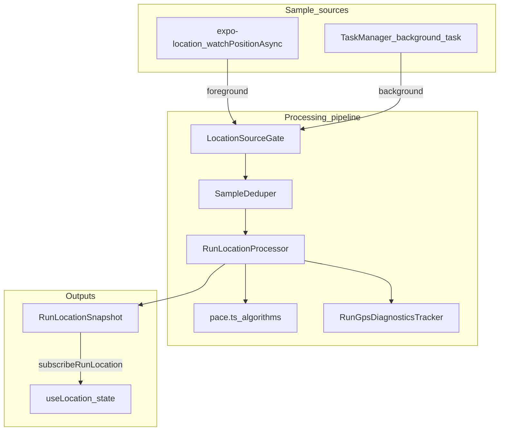

### 11.4 Layer responsibilities

| Layer | Module | Responsibility | Status |
|-------|--------|----------------|--------|
| React adapter | `useLocation.ts` | Permission, subscription lifecycle, AppState, cleanup | **Shipped** |
| Orchestration | `runLocationTracking.ts` | Pub/sub, `processRunLocation`, background task, reset | **Shipped** |
| Source gating | `locationSourceGate.ts` | Process foreground OR background matching app state | **Shipped** |
| Deduplication | `sampleDeduper.ts` | Reject duplicate GPS samples | **Shipped** |
| State processing | `runLocationState.ts` | `RunLocationProcessor` — distance, pace buffers | **Shipped** |
| Pace algorithms | `pace.ts` | Spike rejection, calibration, smoothing, confidence | **Shipped** |
| Diagnostics | `runGpsDiagnostics.ts` | Accepted/rejected counts, source tracking | **Shipped** |

### 11.5 GPS processing rules (shipped)

| Rule | Value / behavior |
|------|------------------|
| Foreground interval | 1 second, high accuracy |
| Background | TaskManager `rrunai-active-run-location` |
| Spike rejection | > 6 m/s |
| Accuracy filter | > 35 m rejected |
| Gap filter | > 10 s |
| Startup calibration | 10 s + 20 m + 6 samples |
| Internal pace | Fast, responsive (coaching input pipeline) |
| Display pace | Smoothed, confidence-gated (UI + `useCoaching`) |
| Display pace hold | 12 s during confidence dips |
| Units | Metres internally; km and min/km at boundaries |

### 11.6 GPS outputs

```typescript
// Shipped
interface RunLocationSnapshot {
  distanceKm: number;
  currentPaceMinPerKm: number | null;  // display pace
  diagnostics: RunLocationDiagnostics;
}
```

### 11.7 Heart-rate architecture (future)

**Direction (not built)** — planned as parallel sensor service:

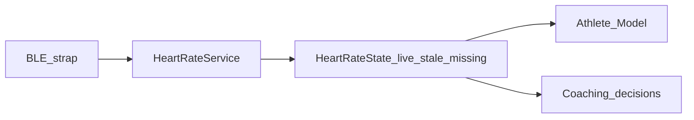

Requirements (from Product Bible and AGENTS.md):

- Timestamped readings; distinguish live, stale, missing, invalid.
- Permission, connection, disconnection, reconnection lifecycle.
- Never crash or block run on strap failure.
- Fall back to GPS pace and workout structure.
- No medical inference.
- Configurable zones with explainable source.
- BLE library requires scoped approval (native dependency).

---

## 12. Data model boundaries

### 12.1 Domain types (shipped)

Defined in `app/types/session.ts`:

```typescript
type BlockType = "warmup" | "work" | "recovery" | "cooldown";

interface WorkoutBlock {
  type: BlockType;
  label: string;
  durationSec: number;
  targetMinPace?: number;   // min/km; smaller = faster
  targetMaxPace?: number;
}

interface Session {
  id: string;
  name: string;
  description: string;
  durationLabel: string;
  targetMinPace?: number;
  targetMaxPace?: number;
  blocks: WorkoutBlock[];
}
```

### 12.2 Coaching types (shipped)

Defined in `app/hooks/useCoaching.ts`:

```typescript
type CoachingState = "too_fast" | "too_slow" | "on_target" | null;

interface CoachingFeedback {
  message: string | null;
  state: CoachingState;
}
```

### 12.3 Block engine types (shipped)

Defined in `app/hooks/useWorkoutBlocks.ts`:

```typescript
interface BlockProgress {
  activeBlock: WorkoutBlock;
  blockIndex: number;
  blockTimeRemaining: number;
  totalBlocks: number;
  isWorkoutComplete: boolean;
  didBlockChange: boolean;
}
```

### 12.4 Sensor types (shipped)

| Type | Module |
|------|--------|
| `RunLocationSnapshot` | `runLocationState.ts` |
| `RunLocationDiagnostics` | `runGpsDiagnostics.ts` |
| `LocationData` | `useLocation.ts` |
| `PacePoint` | `pace.ts` |

### 12.5 Navigation types (shipped)

`RootStackParamList` in `AppNavigator.tsx` — see §2.3.

### 12.6 Boundary rules

| Boundary | Rule |
|----------|------|
| Session / WorkoutBlock | Owned by Training Knowledge Engine; immutable during run |
| BlockProgress | Owned by Run Execution Engine; computed from elapsed time |
| CoachingFeedback | Produced by coaching decision layer; consumed by voice + UI |
| RunLocationSnapshot | Owned by sensor layer; consumed by coaching + UI |
| Navigation params | Ephemeral transport between screens; not a data store |
| Athlete Model | **Direction (not built)** — will own cross-session context |
| Coaching decision protocol | **Direction (not built)** — typed JSON for Python brain |

### 12.7 Units (mandatory at boundaries)

| Quantity | Internal unit | Display unit |
|----------|---------------|--------------|
| Distance | metres | kilometres |
| Time | seconds | formatted mm:ss |
| Speed | m/s (algorithms) | min/km (pace) |
| Pace | min/km | min/km (smaller = faster) |

Never mix units silently across layer boundaries.

---

## 13. Local-first vs backend responsibilities

### 13.1 Principle

Mobile device is authoritative during an active run. Backend (future Python coaching service) augments pre-run and post-run intelligence; it never blocks run execution.

### 13.2 Responsibility matrix

| Responsibility | Owner | Status |
|----------------|-------|--------|
| GPS collection and processing | Local (device) | **Shipped** |
| Block progression and timing | Local (device) | **Shipped** |
| Pace coaching decisions | Local (device) | **Shipped** |
| Block transition voice | Local (device) | **Shipped** |
| Session catalogue (static) | Local (bundled) | **Shipped** |
| Run data during active run | Local (in-memory) | **Shipped** |
| Post-run summary display | Local (navigation params) | **Shipped** |
| Athlete Model persistence | Local (device) | **Direction (not built)** |
| Session history | Local (device) | **Direction (not built)** |
| Heart-rate collection | Local (device) | **Direction (not built)** |
| Pre-run conversation / readiness | Local UI + optional backend LLM | **Direction (not built)** |
| Post-run reflection / learning | Local UI + optional backend LLM | **Direction (not built)** |
| Nuanced coaching decisions | Local fallback + optional Python brain | **Direction (not built)** |
| Training plan generation | — | **Not in scope** (Product Bible) |
| Social / cloud sync | — | **Not in scope** |

### 13.3 Network usage rules (future)

When backend is introduced:

1. During run: **no required network calls**. Ever.
2. Pre-run: backend may be consulted for conversation; local fallback provides static session catalogue.
3. Post-run: backend may be consulted for reflection; local fallback stores raw session summary.
4. Stale or failed backend responses must not corrupt local state.
5. No backend dependency for authentication during MVP.

---

## 14. Deterministic logic vs LLM responsibilities

### 14.1 Deterministic (permanent on-device)

**Shipped** today; must remain on-device permanently:

| Domain | Implementation |
|--------|----------------|
| GPS filtering and pace calculation | `pace.ts`, `runLocationState.ts` |
| Block progression | `useWorkoutBlocks.ts` |
| Pace threshold comparison | `useCoaching.ts` |
| Transition message generation | `transitionMessages.ts` |
| Voice priority and cooldown | `useVoiceCoach.ts`, `useBlockTransitionVoice.ts` |
| Workout completion timing | `RunScreen` |
| Session template validation | `session.ts` (static) |

### 14.2 LLM / Python brain (future)

**Direction (not built)** — responsible for:

| Domain | Mode |
|--------|------|
| Pre-run conversation | Conversation-first |
| Readiness interpretation from conversation | Pre-run |
| Session recommendation rationale | Pre-run |
| Nuanced coaching phrasing | During run (optional; local fallback required) |
| Post-run reflection conversation | Post-run |
| Cross-session adaptation reasoning | Post-run / pre-run |
| Explaining coaching decisions | Post-run |

### 14.3 LLM must never own

- Block transition timing.
- GPS sample acceptance/rejection.
- Voice cooldown enforcement.
- Pace threshold math.
- Run start/stop lifecycle.
- Medical inference.

### 14.4 Handoff pattern (future)

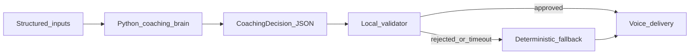

`CoachingDecision` must be a typed, validatable object — not raw natural language injected into voice during a run.

---

## 15. Offline and degraded-network behavior

### 15.1 Current behavior (fully offline)

**Shipped** — the entire app operates offline today. No network calls exist.

| Scenario | Behavior | Status |
|----------|----------|--------|
| No network | App functions normally | **Shipped** |
| GPS permission denied | Error message; run may proceed without GPS | **Shipped** |
| GPS calibrating | "Calibrating GPS"; coaching waits | **Shipped** |
| Background location denied | Foreground GPS continues; user-visible message | **Shipped** |
| Speech failure | Silent; app continues | **Shipped** |
| Heart rate unavailable | — | **Direction (not built)** — fall back to pace |

### 15.2 Future degraded-network rules

When backend and LLM are introduced:

| Scenario | Required behavior |
|----------|-------------------|
| Backend unreachable (pre-run) | Static session catalogue + local Athlete Model |
| Backend unreachable (post-run) | Store session summary locally; skip conversational reflection |
| Backend slow (pre-run) | Timeout → local recommendation |
| Backend slow (during run) | Never consulted |
| Stale LLM response | Discard; use deterministic fallback |
| Partial Athlete Model | Engines degrade with available fields |

### 15.3 During-run guarantee (permanent)

The active run executes identically with or without network connectivity. This is non-negotiable.

---

## 16. Future Python coaching service

### 16.1 Status: **Direction (not built)**

Aligns with Product Bible §9 and §12, and AGENTS.md §8.

### 16.2 Role

Interpret workout intent, runner context, live observations, and coaching history to produce structured coaching decisions for pre-run, during-run (optional phrasing), and post-run modes.

### 16.3 Architecture (target)

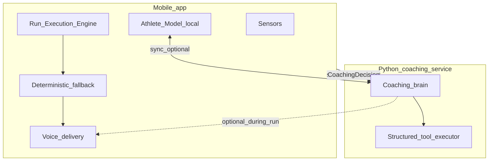

### 16.4 API design principles (future)

- Request and response bodies are typed JSON schemas shared between mobile and Python.
- Mobile sends: athlete context snapshot, session definition, live observations, coaching history summary, app phase.
- Backend returns: `CoachingDecision` with message, priority, timing, rationale, tools invoked.
- Mobile validates response before use; rejects malformed or stale responses.
- Timeout budget: pre-run/post-run generous; during-run zero (or async phrasing only with local fallback already spoken).

### 16.5 Introduction requirements

Per AGENTS.md, adding the Python service requires:

- Scoped task and explicit user approval.
- Defined API contract.
- On-device fallback for all safety-critical paths.
- Graceful latency, offline, and stale-response behavior.
- No premature multi-service cloud architecture.

---

## 17. Structured tool/action model for the AI

### 17.1 Status: **Direction (not built)**

When the Python coaching brain is introduced, it must not operate as an unconstrained text generator inside the mobile app. It invokes **structured tools** with typed inputs and outputs.

### 17.2 Purpose

- Enforce Product Bible guardrails programmatically.
- Keep coaching explainable and auditable.
- Prevent the LLM from inventing invalid workouts, medical advice, or unsafe instructions.

### 17.3 Tool categories (future)

| Tool | Phase | Input | Output |
|------|-------|-------|--------|
| `get_session_catalogue` | Pre-run | — | `Session[]` |
| `recommend_today_session` | Pre-run | `AthleteModel`, `RecoverySignal` | `TodayPlan` |
| `adjust_session` | Pre-run | `Session`, `SessionAdjustment[]` | `Session` |
| `get_athlete_context` | Any | — | `AthleteModel` |
| `record_rpe` | Post-run | `sessionId`, `rpe` | `void` |
| `record_reflection` | Post-run | `ReflectionSummary` | `void` |
| `get_recent_sessions` | Pre/post | `count` | `CompletedSessionSummary[]` |
| `produce_coaching_decision` | During run | `LiveObservations`, `BlockContext` | `CoachingDecision` |
| `explain_decision` | Post-run | `decisionId` | `Explanation` |

### 17.4 Action model

LLM produces **actions** as typed objects, not freeform UI mutations:

```typescript
// Direction (not built) — illustrative only
type CoachingAction =
  | { type: "speak_cue"; message: string; priority: "normal" | "high" }
  | { type: "suggest_session"; session: Session; rationale: string }
  | { type: "adjust_targets"; blockIndex: number; minPace: number; maxPace: number }
  | { type: "ask_runner"; question: string }
  | { type: "record_feedback"; field: string; value: unknown };

interface CoachingDecision {
  actions: CoachingAction[];
  rationale: string;
  inputsUsed: string[];
  timestamp: string;
}
```

### 17.5 Validation rules (future)

- Mobile **validates** every action before execution.
- `adjust_targets` during run requires deterministic bounds checking.
- `suggest_session` must reference valid catalogue entries or validated adjustments.
- `speak_cue` during run passes through voice cooldown and priority rules.
- Rejected actions are logged for auditability.

### 17.6 Relationship to deterministic engines

Tools wrap existing engines — they do not replace them:

| Tool | Wraps |
|------|-------|
| `recommend_today_session` | Adaptive Today Engine |
| `adjust_session` | Training Knowledge Engine |
| `produce_coaching_decision` | Run Execution Engine coaching layer |
| `record_rpe` | Progress Engine |

---

## 18. Data flow: morning check-in to workout to post-run learning

### 18.1 Target flow (future)

**Direction (not built)** — full pipeline:

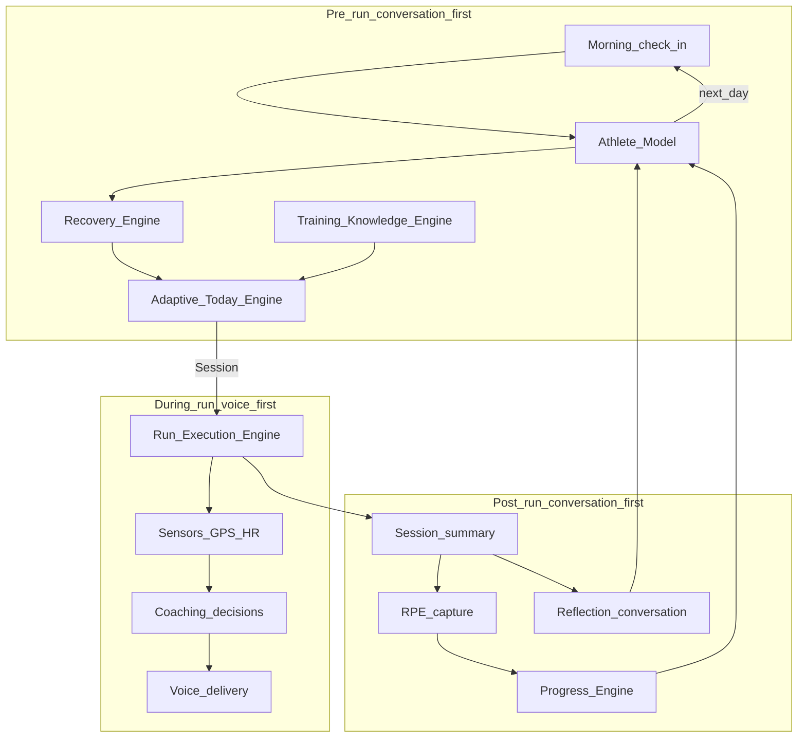

### 18.2 Shipped flow today

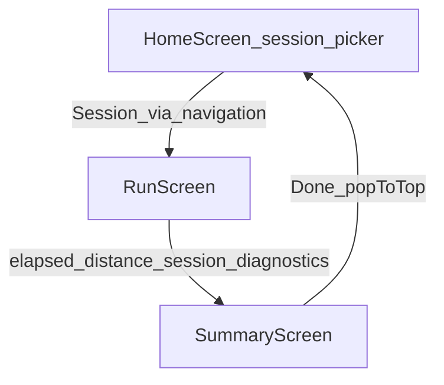

| Step | Data | Persisted? |
|------|------|------------|
| Home: select session | `Session` object | No |
| Run: execute | Timer, GPS snapshot, coaching state | In-memory only |
| Run → Summary | `elapsedSeconds`, `distanceKm`, `session`, `diagnostics?` | No — navigation params |
| Summary: display | Computed avg pace, blocks list | No |
| Summary → Home | — | Data discarded |

### 18.3 Step-by-step (target, future)

| Step | Mode | Engine(s) | Status |
|------|------|-----------|--------|
| 1. Morning check-in | Pre-run conversation | Orchestrator, Athlete Model | **Direction (not built)** |
| 2. Recovery assessment | Pre-run | Recovery Engine | **Direction (not built)** |
| 3. Today plan | Pre-run | Adaptive Today Engine, Training Knowledge Engine | **Direction (not built)** |
| 4. Start run | Transition | Navigation → Run Execution Engine | **Shipped** |
| 5. GPS + block execution | During run | Sensors, Run Execution Engine | **Shipped** |
| 6. Coaching cues | During run | Coaching decisions, Voice | **Shipped** |
| 7. Complete run | During run | Run Execution Engine → Summary | **Shipped** |
| 8. Session summary | Post-run | Progress Engine (display) | **Shipped** (display only) |
| 9. RPE capture | Post-run | Progress Engine | **In progress** |
| 10. Reflection conversation | Post-run | Orchestrator, Python brain | **Direction (not built)** |
| 11. Update athlete context | Post-run | Progress Engine → Athlete Model | **Direction (not built)** |
| 12. Inform next check-in | Cross-session | Athlete Model → Recovery Engine | **Direction (not built)** |

---

## 19. Safety and auditability principles

### 19.1 Safety principles

| Principle | Implementation | Status |
|-----------|----------------|--------|
| Run never blocked by sensor failure | try/catch, null guards, graceful messages | **Shipped** |
| Run never blocked by speech failure | try/catch on all Speech calls | **Shipped** |
| No medical inference | Product guardrail | **Shipped** (policy) |
| No pace coaching during recovery/warm-up | `useCoaching` null when no target | **Shipped** |
| Transition cues override pace cues | `Speech.stop()` in transition hook | **Shipped** |
| GPS noise not used as coaching input | Display pace confidence gating | **Shipped** |
| No divide-by-zero in pace | Guards in `pace.ts` | **Shipped** |
| Location cleanup on run end | `useLocation` stopTracking | **Shipped** |
| During-run: no network dependency | No network calls | **Shipped** |
| LLM cannot control block timing | Architecture rule | **Direction (not built)** — enforced when LLM added |
| HR strap failure does not crash run | — | **Direction (not built)** |

### 19.2 Auditability principles

| Principle | Today | Future |
|-----------|-------|--------|
| Deterministic coaching is inspectable | `CoachingState` enum + pace inputs visible in code | **Shipped** |
| GPS decisions diagnosable | `RunLocationDiagnostics` on Summary | **Shipped** |
| Transition messages traceable | `buildTransitionMessage(blocks, index)` is pure function | **Shipped** |
| LLM decisions log rationale + inputs | — | **Direction (not built)** |
| Tool invocations logged | — | **Direction (not built)** |
| Athlete Model changes versioned | — | **Direction (not built)** |
| Rejected LLM actions logged | — | **Direction (not built)** |

### 19.3 Diagnostics surfaced to user

**Shipped** — GPS debug panel on Summary (structured sessions):

- Accepted / rejected sample counts
- Foreground / background sample counts
- Rejection reasons
- Recalibration count

This supports engineering diagnosis without exposing raw internals to runners in normal mode.

---

## 20. What existing systems should be retained rather than rewritten

These shipped systems are foundational. Extend them; do not replace them.

### 20.1 Retain permanently

| System | Why | Module(s) |
|--------|-----|-----------|
| GPS processing pipeline | High-risk, tested, coaching-grade | `pace.ts`, `runLocationState.ts`, `runLocationTracking.ts`, `locationSourceGate.ts`, `sampleDeduper.ts`, `runGpsDiagnostics.ts` |
| Block engine | Timing-critical, deterministic | `useWorkoutBlocks.ts` |
| Pace coaching state machine | Simple, testable, on-device fallback | `useCoaching.ts` |
| Voice delivery hooks | Decoupled from decision source | `useVoiceCoach.ts`, `useBlockTransitionVoice.ts` |
| Transition message builder | Pure function, tested | `transitionMessages.ts` |
| Session type definitions | Core domain model | `session.ts` |
| Navigation param flow | Clean ephemeral transport | `AppNavigator.tsx` |
| Unit test suite | Regression protection for GPS and coaching | `tests/*.test.ts` |

### 20.2 Extend, do not replace

| System | Extension path |
|--------|----------------|
| `session.ts` | Add distance-based blocks, dynamic adjustments via Training Knowledge Engine |
| `useWorkoutBlocks` | Add distance-based progression alongside time-based |
| `useCoaching` | Add HR input; accept `CoachingDecision` from Python brain as alternative input |
| `useLocation` | Add HR subscription alongside GPS |
| `HomeScreen` | Add conversation UI above or replacing picker; retain catalogue underneath |
| `SummaryScreen` | Add RPE input, then conversation UI; retain stats display |
| `getTodaySession()` | Replace body with Adaptive Today Engine call |

### 20.3 Do not rewrite as LLM responsibilities

- GPS filtering logic
- Block timing and progression
- Voice cooldown and priority
- Pace threshold comparison
- Permission and subscription lifecycle

### 20.4 Safe to introduce new alongside

- Athlete Model store (new module)
- Progress Engine persistence (new module)
- Recovery Engine (new module)
- Conversation UI (new screen components)
- Python coaching client (new service)
- Heart-rate BLE service (new service)

---

## 21. Near-term implementation order

Based on Product Bible §20 roadmap and MVP gaps. Each item references the engine it extends.

### Phase 1 — Complete MVP loop (current focus)

| Order | Work | Engine | Status |
|-------|------|--------|--------|
| 1 | Heart-rate BLE service + lifecycle | Sensor architecture | **Direction (not built)** |
| 2 | HR data in Athlete Model stub | Athlete Model | **Direction (not built)** |
| 3 | HR-aware coaching decisions | Run Execution Engine | **Direction (not built)** |
| 4 | RPE input on Summary | Progress Engine | **In progress** |
| 5 | Session persistence (local) | Progress Engine | **Direction (not built)** |
| 6 | Run pause / resume | Run Execution Engine | **Direction (not built)** |
| 7 | Distance-based blocks | Training Knowledge Engine + Run Execution Engine | **Direction (not built)** |

Priority: items 1–4 complete the MVP coaching loop. Do not start conversation UI or Python service until MVP loop is reliable.

### Phase 2 — Coaching intelligence boundary

| Order | Work | Engine |
|-------|------|--------|
| 8 | Formalize `CoachingDecision` type | Data model |
| 9 | Athlete Model (local persistence) | Athlete Model |
| 10 | Progress Engine (session history) | Progress Engine |
| 11 | Replace `getTodaySession()` stub | Adaptive Today Engine |
| 12 | Expand test coverage for coaching edge cases | All deterministic engines |

### Phase 3 — Conversation and coaching brain (requires approval)

| Order | Work | Engine |
|-------|------|--------|
| 13 | Coaching orchestrator (phase routing) | Orchestration |
| 14 | Pre-run conversation UI | Orchestration + Adaptive Today + Recovery |
| 15 | Post-run conversation UI | Orchestration + Progress |
| 16 | Python coaching service + client | Python brain |
| 17 | Structured tool/action model | Python brain |
| 18 | LLM audit logging | Safety |

### Explicitly deferred

Social, subscriptions, full training-plan generation, marketplace, route navigation, broad wearable support, deep analytics — per Product Bible.

---

## 22. Future extensibility

### 22.1 Extension points (designed in today)

| Extension point | How |
|-----------------|-----|
| New session types | Add to `SESSION_CATALOGUE` in `session.ts` |
| New block types | Extend `BlockType` (requires engine updates) |
| New coaching inputs | Add parameters to `useCoaching` or parallel decision hook |
| New voice paths | New voice hook following `useVoiceCoach` pattern |
| New sensors | New service module + hook, feeding coaching layer |
| New screens | Add to `RootStackParamList` and navigator |
| Backend coaching | `CoachingDecision` type consumed by existing voice hooks |
| Conversation UI | New components; orchestrator routes by phase |

### 22.2 Modularity rules for future work

1. New engines are modules with typed interfaces — not screen-embedded logic.
2. Screens compose engines; they do not contain engine logic.
3. Services have no React dependencies.
4. Hooks adapt services and engine outputs for React lifecycle.
5. Utils are pure functions (testable, no side effects).
6. Every new engine declares its status in this document.

### 22.3 Locked until approved

| Change | Requires approval |
|--------|-------------------|
| Replace Expo / React Native | Yes |
| Add BLE library | Yes |
| Add Python backend | Yes |
| Add global state management | Yes |
| Add cloud sync / auth | Yes |
| Replace GPS pipeline | Yes — high risk |
| Replace voice delivery | Yes |

### 22.4 Engine maturity roadmap

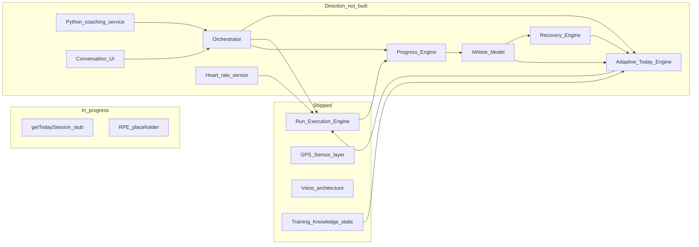

---

## Appendix A: File-to-engine mapping

| File | Engine / layer | Status |
|------|----------------|--------|
| `app/types/session.ts` | Training Knowledge Engine | **Shipped** |
| `app/hooks/useWorkoutBlocks.ts` | Run Execution Engine | **Shipped** |
| `app/hooks/useCoaching.ts` | Run Execution Engine | **Shipped** |
| `app/hooks/useVoiceCoach.ts` | Voice architecture | **Shipped** |
| `app/hooks/useBlockTransitionVoice.ts` | Voice architecture | **Shipped** |
| `app/utils/transitionMessages.ts` | Run Execution Engine | **Shipped** |
| `app/hooks/useLocation.ts` | Sensor architecture | **Shipped** |
| `app/services/runLocationTracking.ts` | Sensor architecture | **Shipped** |
| `app/services/runLocationState.ts` | Sensor architecture | **Shipped** |
| `app/services/locationSourceGate.ts` | Sensor architecture | **Shipped** |
| `app/services/sampleDeduper.ts` | Sensor architecture | **Shipped** |
| `app/services/runGpsDiagnostics.ts` | Sensor architecture | **Shipped** |
| `app/utils/pace.ts` | Sensor architecture | **Shipped** |
| `app/screens/HomeScreen.tsx` | Orchestration (pre-run stub) | **Shipped** |
| `app/screens/RunScreen.tsx` | Run Execution Engine | **Shipped** |
| `app/screens/SummaryScreen.tsx` | Progress Engine (display only) | **Shipped** |
| `app/navigation/AppNavigator.tsx` | Navigation / phase transitions | **Shipped** |
| `app/utils/formatters.ts` | Shared utilities | **Shipped** |

## Appendix B: Related documents

| Document | Relationship |
|----------|--------------|
| [`PRODUCT_BIBLE.md`](PRODUCT_BIBLE.md) | Product authority — what and why |
| [`AGENTS.md`](../AGENTS.md) | Implementation safety — how to build |
| [`TRAINING_PRINCIPLES.md`](TRAINING_PRINCIPLES.md) | Training science detail (reserved) |
| [`ROADMAP.md`](ROADMAP.md) | Execution timeline (reserved) |
| [`DECISIONS.md`](DECISIONS.md) | Architecture decision log (reserved) |

---

*Last updated: September 2026 (v1.0). This document must stay aligned with `PRODUCT_BIBLE.md`. When in doubt, Product Bible governs product scope; this document governs technical structure.*
