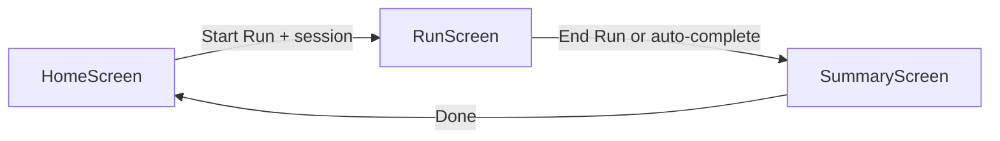
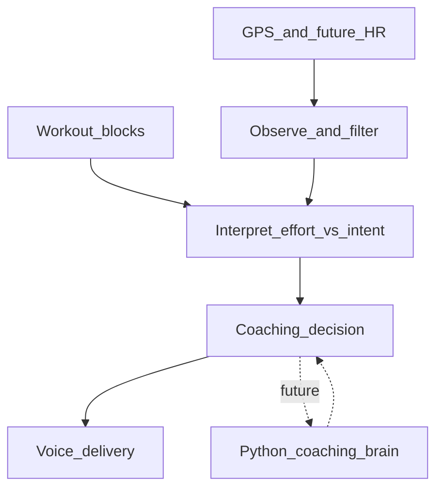
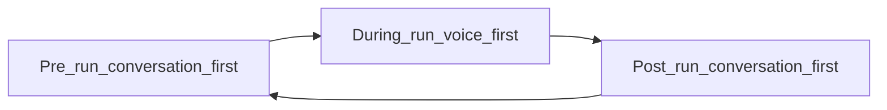

# rRunAI Product Bible

**Version 1.1 — Internal source of truth**

This document is the permanent authority for product, architecture, and engineering decisions in rRunAI. Every AI agent and engineer must read it before modifying product behavior, coaching logic, or user-facing flows.

---

## How to use this document

| Document | Role |
|----------|------|
| This file (`PRODUCT_BIBLE.md`) | **What** rRunAI is and **why** — product intent, principles, guardrails |
| [`AGENTS.md`](../AGENTS.md) | **How** to implement safely — stack rules, high-risk areas, workflow |
| [`ARCHITECTURE.md`](ARCHITECTURE.md) | System design detail (reserved) |
| [`TRAINING_PRINCIPLES.md`](TRAINING_PRINCIPLES.md) | Deeper training science (reserved) |
| [`ROADMAP.md`](ROADMAP.md) | Phased execution detail (reserved) |
| [`DECISIONS.md`](DECISIONS.md) | Decision log (reserved) |

When product intent in this document and implementation rules in `AGENTS.md` overlap, both apply. This document takes precedence on **what to build and why**. `AGENTS.md` takes precedence on **how to build it safely**.

### Status legend

Every capability in this document is labeled with one of three statuses:

| Status | Meaning |
|--------|---------|
| **Shipped** | Exists in the codebase and is functional today |
| **In progress** | Partially implemented or placeholder present |
| **Direction (not built)** | Architectural intent or future vision; not a commitment to build without scoped approval |

---

## 1. Vision

rRunAI is a **conversation-first** coaching intelligence for runners.

The athlete communicates naturally with rRunAI — but the **modality changes depending on context**. Before and after a run, conversation is the primary interface (initially text, later optionally voice). During an active run, voice guidance is primary, with a glanceable screen for safety.

The product exists so that every minute a runner spends training outdoors serves a purpose. Tracking distance and pace is essential, but it is an input to coaching — not the product itself.

The runner is the hero. rRunAI is the guide. The product should support the runner's judgment and progress rather than draw attention to itself.

### Target user

The primary user is a **midlife recreational runner, especially age 40+**, who wants to train effectively while balancing recovery, health, work, family, and limited training time.

Design and engineering decisions must account for:

- The need for clear, calm guidance during physical effort.
- Varying levels of technical and running experience.
- Age-aware training, recovery, and injury-risk considerations.
- Limited attention during a run.
- The importance of making every training session purposeful.
- A runner who may use a phone, headphones, and a heart-rate strap while outdoors.

Do not assume the user is an elite athlete or a professional coder.

---

## 2. Mission

> Once a runner steps out the door, no minute of training is wasted.

rRunAI observes the run, understands the planned workout and the runner's current effort, and delivers timely guidance that helps the runner train with purpose.

### The core real-time loop

1. Understand the workout and its current block.
2. Observe GPS pace, elapsed time, distance, heart rate, and relevant session state.
3. Interpret whether the runner is executing the intended training stimulus.
4. Deliver concise voice guidance at the right moment.
5. Adapt future guidance without distracting or overwhelming the runner.

Steps 1–4 are partially **Shipped** today (GPS and voice coaching work; heart rate is **Direction (not built)**). Step 5 (adaptation across sessions) is **Direction (not built)**.

---

## 3. North Star

**Help every runner complete each session with the intended training stimulus — not just log miles.**

This is a product compass, not a dashboard metric. Success means the runner executed the workout they set out to do — at the right effort, through the right structure — with calm, timely guidance along the way.

The North Star applies across all three interaction modes (§14): purposeful pre-run planning, correct execution during the run, and meaningful post-run reflection that informs the next session.

---

## 4. Product Promise

When a runner uses rRunAI, they can expect:

- **Natural communication** — the athlete interacts conversationally with rRunAI before and after runs; during the run, voice guidance takes over. Pre-run and post-run conversation are **Direction (not built)**; during-run voice is **Shipped**.
- **Clarity in the moment** — they will know what to do right now during a run: start an interval, slow down, hold steady, begin cool-down. **Shipped**
- **Calm, concise guidance** — during-run cues are spoken, short, and actionable; the app does not demand attention while moving. **Shipped**
- **Purposeful structure** — workouts are organized into blocks (warm-up, work, recovery, cool-down) that match how recreational runners actually train. **Shipped**
- **Safe degradation** — when GPS is calibrating, heart rate is unavailable, or speech fails, the run continues; the app does not crash or block progress. **Shipped** (heart-rate fallback is **Direction (not built)** until strap integration exists)
- **Respect for the runner** — rRunAI supports judgment; it does not replace it.

---

## 5. What rRunAI Is

rRunAI is all of the following:

| What it is | Status |
|------------|--------|
| A **conversation-first coaching intelligence** for recreational runners, especially midlife runners (age 40+) balancing health, recovery, work, and family. Interaction modality shifts by context (see §14). | **Direction (not built)** for pre/post-run conversation; **Shipped** for during-run coaching |
| A **voice-first during-run coach** — real-time spoken guidance with minimal interaction and a glanceable safety screen while the runner is moving | **Shipped** |
| A **structured workout executor** — sessions are sequences of timed blocks with defined types (warm-up, work, recovery, cool-down) and optional pace targets per block | **Shipped** |
| A **real-time sensor observer** — GPS location, distance, and filtered display pace for coaching-grade decisions | **Shipped** |
| A **deterministic on-device coach** — pace compared to block targets; spoken transitions between blocks | **Shipped** |
| A **glanceable companion screen** during runs and a **post-run summary** after | **Shipped** |
| A product with a **clear path toward a Python-based coaching brain** that interprets workout intent, runner context, live observations, and coaching history | **Direction (not built)** |
| A product that incorporates **heart-rate strap data** into coaching when available | **Direction (not built)** |

---

## 6. What rRunAI Is NOT

rRunAI is explicitly not any of the following. These boundaries are permanent unless scope is deliberately changed.

| What it is not | Notes |
|----------------|-------|
| Primarily a run tracker, dashboard, or statistics app | Tracking serves coaching |
| A social platform | No feeds, clubs, challenges, leaderboards, or public profiles |
| A subscription, payment, or advertising product | — |
| A full training-plan generator or coach marketplace | — |
| A route discovery, mapping, or turn-by-turn navigation app | — |
| A deep post-run analytics platform | Not competing with dedicated analysis tools |
| Medical advice | Coaching must not be presented as diagnosis or treatment |
| A replacement for runner judgment | The runner decides when to stop, push, or rest |

---

## 7. Non-Negotiable Product Principles

These principles apply to every product and engineering decision. They are not negotiable.

1. **Conversation-first overall; voice-first during effort.** Before and after a run, the athlete interacts conversationally with rRunAI. During an active run, spoken guidance is primary and the screen is a glanceable companion for safety.

2. **Runner judgment is respected.** rRunAI guides; it does not command.

3. **Every cue must earn attention.** Use cooldowns, deduplication, and priority rules. Transition cues outrank pace cues.

4. **Coaching stays quiet when appropriate.** Blocks without pace targets (warm-up, recovery, cool-down) must not produce pace corrections.

5. **Graceful degradation.** GPS calibration, missing heart rate, speech failures, and permission denial must not crash or block a run.

6. **Age-aware design.** Assume limited attention during physical effort, varying technical experience, and recovery considerations for midlife runners.

7. **Tracking serves coaching.** Do not build tracking or analytics features that displace the real-time coaching loop.

8. **Reliable end-to-end loop over shallow features.** MVP work favors a working coaching journey over a large feature surface.

9. **Modality follows context.** Do not force the runner to read, type, or navigate complex UI during physical effort. Do not force voice interaction when the runner has full attention and wants to reflect or plan.

10. **Explainability over black boxes.** Coaching decisions must be traceable to understandable inputs (block type, pace target, heart-rate zone, session structure).

---

## 8. MVP Definition

### MVP-critical capabilities

Per product scope, the MVP must deliver all of the following. Status reflects the codebase today.

| Capability | Status |
|------------|--------|
| Start, complete, and summarize a running session | **Shipped** |
| Pause where supported | **Direction (not built)** |
| Request and handle location permission safely | **Shipped** |
| Track location, elapsed time, distance, current pace, and useful pace trends with GPS | **Shipped** |
| Define structured workouts as timed or distance-based blocks | **In progress** — time-based blocks **Shipped**; distance-based **Direction (not built)** |
| Progress reliably through warm-up, work, recovery, and cool-down blocks | **Shipped** |
| Interpret workout targets and live sensor data for real-time coaching decisions | **Shipped** (pace only; HR **Direction (not built)**) |
| Deliver spoken workout transitions, pace guidance, effort guidance, and useful coaching cues | **Shipped** (pace and transitions; effort/HR guidance **Direction (not built)**) |
| Connect to and read data from a supported heart-rate strap | **Direction (not built)** |
| Incorporate heart-rate data into coaching when available | **Direction (not built)** |
| Degrade safely when heart-rate data is unavailable or disconnected | **Direction (not built)** |
| Keep the active-run screen simple and glanceable | **Shipped** |
| Show a useful post-run summary | **Shipped** |
| Support the Home → Run → Summary journey | **Shipped** |
| Maintain a clear path toward a Python-based coaching brain | **Direction (not built)** — architectural boundary prepared in code structure |

### Feature inventory — shipped today

| Feature | Status | Notes |
|---------|--------|-------|
| Home → Run → Summary navigation | **Shipped** | Native stack, no headers |
| Session catalogue | **Shipped** | Easy Run, Threshold Run, Interval Run, Free Run |
| Session picker on Home | **Shipped** | Default: Easy Run via `getTodaySession()` |
| Time-based workout blocks | **Shipped** | Elapsed time drives block progression |
| Block types: warm-up, work, recovery, cool-down | **Shipped** | Defined in `session.ts` |
| Per-block pace targets | **Shipped** | Optional; coaching silent when absent |
| GPS foreground tracking | **Shipped** | `expo-location`, high accuracy, 1s interval |
| GPS background tracking during active run | **Shipped** | Degrades gracefully if permission denied |
| Pace filtering, calibration, confidence gating | **Shipped** | `pace.ts`, `runLocationState.ts` |
| Display pace for coaching and UI | **Shipped** | Smoothed; separate from internal pace |
| GPS diagnostics on Summary | **Shipped** | Accepted/rejected samples, foreground/background counts |
| Pace coaching vs active block targets | **Shipped** | `useCoaching.ts`, 8s evaluation interval |
| Voice pace cues | **Shipped** | 25s cooldown, queue latest during cooldown |
| Voice block transition cues | **Shipped** | Priority over pace cues; context-aware numbering |
| Voice workout completion cue | **Shipped** | One-shot on structured workout complete |
| Auto-complete structured workouts | **Shipped** | Navigates to Summary after last block |
| Manual End Run | **Shipped** | Available anytime |
| Free Run mode | **Shipped** | GPS + timer only; no blocks or coaching |
| Post-run summary stats | **Shipped** | Duration, planned duration, distance, avg pace |
| Completed blocks list on Summary | **Shipped** | Structured sessions only |
| Coaching banner on Run screen | **Shipped** | Visual companion to voice cues |
| Block progress bar on Run screen | **Shipped** | Shows active block and time remaining |

### Feature inventory — not yet built

| Feature | Status | Notes |
|---------|--------|-------|
| Heart-rate strap integration (BLE) | **Direction (not built)** | MVP-critical per product scope |
| Heart-rate zones in coaching | **Direction (not built)** | — |
| RPE input on Summary | **In progress** | Placeholder text: "RPE input coming soon" |
| Run pause / resume | **Direction (not built)** | — |
| Distance-based blocks | **Direction (not built)** | MVP scope includes; only time-based exists |
| Effort-based coaching (beyond pace) | **Direction (not built)** | — |
| Pre-run conversational interface | **Direction (not built)** | Session picker exists today |
| Post-run conversational interface | **Direction (not built)** | Stats summary exists today |
| Concise voice commands from runner | **Direction (not built)** | e.g., pause, skip block |
| Python coaching service | **Direction (not built)** | — |
| Athlete model / runner context store | **Direction (not built)** | — |
| Session history and adaptation across runs | **Direction (not built)** | — |
| Personalized workout recommendations | **Direction (not built)** | — |
| Daily readiness scoring | **Direction (not built)** | — |

---

## 9. Long-Term Product Vision

### Coaching intelligence

The long-term coaching intelligence will have a **Python-based coaching brain**. This brain will interpret workout intent, runner context, live observations, and coaching history to produce structured coaching decisions. **Direction (not built)**

Architectural boundaries for this direction:

- Mobile sensor collection and active-run safety remain reliable on the device.
- Coaching inputs and outputs stay explicit, typed, and serializable.
- The decision to coach is separate from the mechanism that speaks the cue.
- Deterministic rules handle safety-critical and timing-critical behavior.
- On-device fallback preserves essential workout transitions and basic guidance when the service is unavailable, slow, or offline.

This direction is an architectural boundary to prepare for — not permission to over-engineer the MVP. Do not add a Python service, API contract, cloud deployment, or networking dependency without a scoped task and explicit approval.

### Interaction vision

The athlete communicates naturally with rRunAI across the full training day. Modality adapts to context:

| Context | Modality | Status |
|---------|----------|--------|
| Before the run | Conversation-first (text initially; voice optionally later) | **Direction (not built)** |
| During the run | Voice-first with concise voice commands | **Shipped** (voice commands **Direction (not built)**) |
| After the run | Conversation-first (text initially; voice optionally later) | **Direction (not built)** |

The coaching brain powers all three interaction modes with consistent runner context. **Direction (not built)**

### Explicitly not part of long-term MVP scope

Unless scope is deliberately changed, the following remain out of scope:

- Social feeds, messaging, clubs, challenges, leaderboards
- Public runner profiles or social sharing
- Subscriptions, payments, advertising, referral systems
- Full long-term training-plan generation
- Marketplace or coach-management features
- Advanced route discovery, mapping, or turn-by-turn navigation
- Broad wearable support beyond the heart-rate strap path
- Deep post-run analytics competing with dedicated platforms
- Cosmetic redesigns that do not improve the real-time coaching experience

---

## 10. Core User Journey

The app follows a single linear journey: **Home → Run → Summary**. Each phase maps to a distinct interaction mode (see §14).



| Phase | Screen | Interaction mode | Primary interface today | Long-term interface |
|-------|--------|------------------|------------------------|---------------------|
| Pre-run | Home | Conversation-first | Session selection (**Shipped**) | Conversational coaching, readiness, planning, adaptation (**Direction (not built)**) |
| During run | Run | Voice-first | Spoken coaching + glanceable screen (**Shipped**) | Same, plus concise voice commands (**Direction (not built)**) |
| Post-run | Summary | Conversation-first | Run stats summary (**Shipped**) | Reflection, feedback, learning, explanations (**Direction (not built)**) |

### Home (pre-run)

**Shipped** — session selection interface. **Direction (not built)** — conversational pre-run coaching.

- Displays the app title and a session picker from `SESSION_CATALOGUE`.
- Default session: Easy Run (`getTodaySession()` returns the first catalogue entry).
- Session card shows name, duration label, description, and session-level pace target.
- **Start Run** navigates to Run with the selected session.

Available sessions:

| Session | Duration | Description | Status |
|---------|----------|-------------|--------|
| Easy Run | ~14 min | Conversational pace; warm-up + easy + cool-down | **Shipped** |
| Threshold Run | ~14 min | Comfortably hard; two threshold blocks with recovery | **Shipped** |
| Interval Run | ~11 min | Fast repeats with recovery jogs | **Shipped** |
| Free Run | Open | GPS test run; no structure | **Shipped** |

### Run (during run)

**Shipped** — voice-first real-time coaching for structured sessions.

Two paths depending on session type:

| Session type | Timer | GPS | Blocks | Coaching | Auto-complete |
|--------------|-------|-----|--------|----------|---------------|
| Structured (Easy, Threshold, Interval) | **Shipped** | **Shipped** | **Shipped** | **Shipped** | **Shipped** |
| Free Run | **Shipped** | **Shipped** | — | — | — |

During a structured run:

1. Elapsed timer starts on mount.
2. GPS tracking begins (foreground; background if permitted).
3. Workout blocks advance by elapsed time.
4. Coaching compares display pace to the active block's target window.
5. Voice delivers pace cues and block-transition announcements.
6. On workout complete: speaks "Workout complete. Nice work.", waits 3 seconds, stops GPS, navigates to Summary.
7. **End Run** is available anytime and bypasses auto-complete.

Run screen displays: elapsed time, distance, current pace (or "Calibrating GPS"), active block label, block time remaining, block progress bar, coaching banner.

### Summary (post-run)

**Shipped** — stats summary. **In progress** — RPE placeholder. **Direction (not built)** — conversational reflection.

Receives: elapsed seconds, distance, session, optional GPS diagnostics.

Shows:

- Run summary: duration, planned duration (structured only), distance, average pace.
- Completed blocks list (structured only).
- GPS debug panel (when diagnostics passed).
- RPE placeholder: "RPE input coming soon" (**In progress**).
- **Done** returns to Home via `popToTop()`.

---

## 11. Adaptive Coaching Philosophy

### Philosophy

Coaching should adapt over the course of a session and across sessions — adjusting guidance based on how the runner is executing the intended stimulus — without distracting or overwhelming the runner. **Direction (not built)** for cross-session adaptation; partial session-level adaptation **Shipped** via block-aware targeting.

Adaptation means:

- Fewer, higher-value cues rather than constant commentary.
- Block-aware silence when no target applies. **Shipped**
- Future incorporation of heart rate and perceived effort when available. **Direction (not built)**
- Respect for cooldowns so the runner can actually run. **Shipped**
- Pre-run plan adjustments based on readiness conversation. **Direction (not built)**
- Post-run learning that informs the next session. **Direction (not built)**

### Today

Coaching is **fully deterministic and on-device** (**Shipped**):

- Pace is evaluated every 8 seconds against the active block's target window.
- Three states: too fast, too slow, on target — each maps to a fixed spoken phrase.
- No personalization, no session history, no adaptive plan changes.
- Block transition messages are context-aware (e.g., "Interval 2 of 3, start now") but rule-based, not AI-generated.

### Principles for future adaptation

- Never contradict safety-critical block transitions.
- Prefer on-target silence over constant affirmation when the runner is executing well.
- Any future adaptive logic must respect voice cooldowns and deduplication.
- Adaptation must remain explainable to the runner.
- Adaptation signals flow through conversation in pre-run and post-run modes, not hidden algorithmic overrides.

---

## 12. AI Responsibilities vs Deterministic Engine Responsibilities

### Deterministic engine (device, now) — Shipped

These responsibilities stay on the device and use rule-based logic. They must remain deterministic even after a Python coaching brain exists.

| Responsibility | Implementation | Status |
|----------------|----------------|--------|
| Workout block progression | `useWorkoutBlocks.ts` — elapsed time drives active block | **Shipped** |
| GPS sample deduplication | `sampleDeduper.ts` | **Shipped** |
| GPS source gating (foreground/background) | `locationSourceGate.ts` | **Shipped** |
| GPS sample processing and pace filtering | `pace.ts`, `runLocationState.ts`, `runLocationTracking.ts` | **Shipped** |
| GPS diagnostics tracking | `runGpsDiagnostics.ts` | **Shipped** |
| Pace threshold comparison | `useCoaching.ts` — pace vs block target window | **Shipped** |
| Block transition message generation | `transitionMessages.ts` | **Shipped** |
| Block transition voice delivery | `useBlockTransitionVoice.ts` — priority over pace cues | **Shipped** |
| Voice cooldown and deduplication | `useVoiceCoach.ts` — 25s cooldown, queue latest | **Shipped** |
| Workout completion announcement | `RunScreen` — one-shot completion cue | **Shipped** |
| Permission handling and sensor cleanup | `useLocation.ts` | **Shipped** |
| Location permission strings | `app.json` | **Shipped** |

Safety-critical and timing-critical behavior must remain deterministic permanently.

### Future AI / Python coaching brain — Direction (not built)

The coaching brain will:

- Interpret workout intent, runner context, live observations, and coaching history.
- Produce structured, typed coaching decisions (message, priority, timing).
- Enable nuanced phrasing and contextual adaptation beyond fixed phrases.
- Power pre-run conversation (readiness, planning, adaptation).
- Power post-run conversation (reflection, feedback, learning, explanations).

The coaching brain will **not**:

- Replace on-device block progression or transition timing.
- Remove the on-device fallback for essential transitions.
- Operate without graceful handling of latency, stale responses, and offline states.
- Make medical inferences from heart-rate or other sensor data.

### Boundary rule

**Decision to coach ≠ mechanism that speaks.**

The mobile app must run essential workout transitions and basic guidance without network connectivity.



| Layer | Today | Future |
|-------|-------|--------|
| Observe and filter | Deterministic on-device (**Shipped**) | Same + HR (**Direction (not built)**) |
| Interpret effort vs intent | Deterministic rules (**Shipped**) | Python brain + on-device fallback (**Direction (not built)**) |
| Coaching decision | `useCoaching.ts` (**Shipped**) | Typed decision object (**Direction (not built)**) |
| Voice delivery | `useVoiceCoach.ts`, `useBlockTransitionVoice.ts` (**Shipped**) | Same mechanism, richer input (**Shipped**) |

---

## 13. Athlete Model Vision

**Direction (not built)** — no athlete model exists in the codebase today.

The long-term vision is a **typed, serializable representation of runner context** that the coaching brain (on-device or Python) uses to make better decisions across all three interaction modes.

### What it may include (future)

| Data | Purpose | Status |
|------|---------|--------|
| Age-aware training and recovery considerations | Inform intensity and recovery guidance | **Direction (not built)** |
| Session history and recent training load | Inform plan adaptation | **Direction (not built)** |
| Perceived effort (RPE) | Subjective feedback loop | **In progress** (placeholder on Summary) |
| Heart-rate zones and thresholds | Effort guidance beyond pace | **Direction (not built)** |
| Configurable pace targets and workout preferences | Personalization | **Direction (not built)** |
| Pre-run readiness signals from conversation | Daily planning | **Direction (not built)** |
| Post-run reflection and learning signals | Cross-session adaptation | **Direction (not built)** |

### What it is not

- A medical profile or health record.
- A social identity or public profile.
- A black box — coaching decisions must cite understandable sources (block type, pace target, heart-rate zone configuration, conversation context).

### Design requirements

- Inputs and outputs must be explicit and serializable.
- The model must support graceful degradation when data is missing or stale.
- No athlete model feature should block the core run loop.
- The athlete model is shared context across pre-run, during-run, and post-run modes.

---

## 14. Conversation-First Interface Philosophy

**Conversation-first** is the overall product philosophy. **Voice-first** is the interaction philosophy during an active run. These are complementary, not competing.

The long-term vision is that the athlete communicates naturally with rRunAI, but the **modality changes depending on context**.

### Three interaction modes

| Mode | When | Primary interface | Purpose | Status |
|------|------|-------------------|---------|--------|
| **Pre-run** | Before the run | Conversation-first (text initially; voice optionally later) | Daily coaching, readiness, planning, adaptation | **Direction (not built)** — session picker **Shipped** |
| **During run** | Active run | Voice-first | Real-time coaching, minimal interaction, safety | **Shipped** |
| **Post-run** | After the run | Conversation-first (text initially; voice optionally later) | Reflection, feedback, learning, explanations | **Direction (not built)** — stats summary **Shipped** |



### Pre-run: Conversation-first

**Direction (not built)** — today the Home screen uses session selection, not a conversational interface.

The athlete will discuss the day ahead: how they feel, what workout is appropriate, and how the plan may adapt.

Topics:

- Daily coaching and motivation
- Readiness assessment (how the body feels, recovery status)
- Session planning (which workout, what targets)
- Workout adjustments (modify blocks, swap session type)

Initial modality: **text conversation**. Voice input/output may be added later when context allows full attention.

What exists today (**Shipped**):

- Session catalogue with four session types
- Session picker UI on Home
- Session card with name, duration, description, pace target
- Start Run button

### During run: Voice-first

**Shipped** — this is what the codebase implements today.

- Spoken language is the primary interface. The runner listens; they do not read, tap through menus, or study charts while moving.
- Cues are concise, calm, and actionable. The most important instruction comes first ("Interval 2 of 3, start now" before pace detail).
- The screen shows glanceable state for **safety**, not as the primary coaching channel:
  - Current pace (or "Calibrating GPS")
  - Elapsed time
  - Distance
  - Active block label and time remaining
  - Block progress bar
  - Coaching banner (color-coded: green / yellow / red)
- Pace coaching uses fixed phrases: "Slow down slightly," "Pick it up a bit," "Good pace, keep it steady."

**Concise voice commands** from the runner (e.g., pause, skip block, end early) are **Direction (not built)**. When built, they must be scoped separately and must not displace the voice-first coaching output.

#### Voice priority during run

| Cue type | Priority | Behavior | Status |
|----------|----------|----------|--------|
| Block transitions | Highest | Interrupts current speech | **Shipped** |
| Workout completion | High | One-shot; interrupts current speech | **Shipped** |
| Pace corrections | Normal | Respects 25-second cooldown | **Shipped** |

#### Voice delivery rules

| Rule | Status |
|------|--------|
| 25-second cooldown between pace messages | **Shipped** |
| Queue latest message during cooldown (discard stale) | **Shipped** |
| `Speech.stop()` before transition cues | **Shipped** |
| try/catch on all speech calls — silent failure | **Shipped** |
| Cleanup on unmount: stop speech, clear timers | **Shipped** |
| Transition speech rate: 1.0; pace speech rate: 1.05 | **Shipped** |

### Post-run: Conversation-first

**Direction (not built)** — today the Summary screen shows run stats and an RPE placeholder, not a conversational interface.

The athlete will reflect on the session: how it felt, what was learned, what to adjust next time.

Topics:

- Reflection on session quality
- Subjective feedback (RPE, how legs felt, effort level)
- Coaching explanations (why targets were set, what was achieved)
- Adaptation signals for future sessions

Initial modality: **text conversation**. Voice optionally later.

What exists today:

| Feature | Status |
|---------|--------|
| Duration, planned duration, distance, average pace | **Shipped** |
| Completed blocks list | **Shipped** |
| GPS debug panel | **Shipped** |
| RPE input | **In progress** (placeholder only) |
| Conversational reflection | **Direction (not built)** |

### Terminology note

**"Conversational pace"** in the Easy Run session is a training intensity description (easy enough to hold a conversation while running), not the conversation-first product interface. Do not conflate the two.

---

## 15. Daily Readiness Philosophy

Readiness is part of the **pre-run conversation-first** interaction mode (§14). The athlete and rRunAI discuss how the day looks before stepping out the door.

**Direction (not built)** — readiness is a philosophy and interaction design direction, not a shipped feature.

### Principles

- Training should be purposeful, not maximal. Every session has an intended stimulus.
- Recovery blocks and easy days are structurally part of workouts — not afterthoughts. **Shipped** in session block structure.
- Age-aware recovery and injury-risk awareness inform how guidance is delivered (calm, not pushy).
- rRunAI should not pressure intensity when context suggests restraint.
- Readiness informs planning and adaptation through **conversation** — not through a dashboard the runner must interpret alone.

### What readiness means in rRunAI

Readiness is not a single score. It is the runner's holistic state — physical, mental, and contextual — that informs whether today's planned workout is appropriate and how it might be adjusted. This emerges through pre-run conversation, not algorithmic calculation alone.

### What this is not (today)

| Capability | Status |
|------------|--------|
| Daily readiness score | **Direction (not built)** |
| HRV dashboard | **Direction (not built)** |
| Sleep integration | **Direction (not built)** |
| Morning questionnaire | **Direction (not built)** |
| Pre-run conversational interface | **Direction (not built)** |
| Automated workout modification based on readiness | **Direction (not built)** |

The RPE placeholder on the Summary screen hints at a future subjective feedback loop in the **post-run conversation-first** mode. **In progress** (placeholder only).

---

## 16. Real-Time Run Guidance Philosophy

Real-time guidance is the heart of the **during-run, voice-first** interaction mode (§14). These rules reflect what is implemented today and what must be preserved.

### Block-aware targeting — Shipped

- Pace targets come from the **active block**, not the session-level default.
- Warm-up, recovery, and cool-down blocks without pace targets produce **no pace coaching** — the coach stays quiet.
- This prevents incorrect cues like "slow down" during an easy recovery jog.
- Session-level pace targets are used for Home screen display and as fallback only.

### Pace quality — Shipped

- Coaching uses **display pace** — smoothed, confidence-gated output from the GPS pipeline — not raw instantaneous GPS noise.
- Internal pace (fast, responsive) and display pace (stable, for UI and coaching) are distinct.
- During startup calibration (10s + 20m + 6 samples), pace is unavailable; UI shows "Calibrating GPS" and coaching waits.
- Spike rejection (>6 m/s), accuracy filter (>35m), gap filter (>10s), and sample deduplication protect pace quality.
- GPS diagnostics are preserved for post-run review.

### Guidance cadence — Shipped

| Parameter | Value |
|-----------|-------|
| Pace evaluation interval | 8 seconds |
| Voice cooldown (pace cues) | 25 seconds |
| Block transition voice | Immediate (no cooldown) |
| Workout completion voice | One-shot |

### Message design — Shipped

**Pace coaching messages:**

| State | Message |
|-------|---------|
| Too fast | "Slow down slightly" |
| Too slow | "Pick it up a bit" |
| On target | "Good pace, keep it steady" |
| No target for block | Silent (banner shows "Coach warming up…") |
| No reliable pace yet | Silent |

**Block transition messages** (examples from `transitionMessages.ts`):

| Transition | Example message |
|------------|-----------------|
| Warm-up → Work | "Warm-up complete. Interval 1 of 3, start now." |
| Work → Recovery | "Interval complete. Recover now." |
| Recovery → Work | "Recovery complete. Interval 2 of 3, start now." |
| Work → Cool-down | "Intervals complete. Begin cool-down." |

### Sensor degradation — Shipped

| Condition | Behavior |
|-----------|----------|
| Missing pace (calibrating) | Coaching waits; no invalid pace values emitted |
| Missing heart rate | Fall back to GPS pace and workout structure (**Direction (not built)** for HR integration) |
| Speech failure | App continues silently; never crashes |
| Background location denied | Foreground tracking continues; user-visible message |
| Permission denied | Graceful handling; run may proceed without GPS |

### Heart-rate guidance — Direction (not built)

When heart-rate strap integration is built (MVP-critical):

- Heart-rate values must be timestamped.
- Distinguish live, stale, missing, and invalid data.
- Incorporate HR into coaching when available.
- Fall back safely to GPS pace and workout structure when unavailable.
- Do not infer medical conclusions from heart-rate data.
- Keep heart-rate zones configurable and explain their source.

---

## 17. Training Philosophy

rRunAI's training approach reflects the needs of midlife recreational runners, not elite performance optimization.

### Structured workouts — Shipped

A workout is a **sequence of purposeful blocks**, not undifferentiated running time:

| Block type | Purpose | Pace target | Status |
|------------|---------|-------------|--------|
| Warm-up | Prepare the body | None — coaching silent | **Shipped** |
| Work | Main training stimulus | Defined per block | **Shipped** |
| Recovery | Easy jogging between hard efforts | None — coaching silent | **Shipped** |
| Cool-down | Wind down | None — coaching silent | **Shipped** |

### Session types — Shipped

| Session | Stimulus | Block structure | Work pace target |
|---------|----------|-----------------|------------------|
| Easy Run | Aerobic base | 2m warm-up → 10m easy → 2m cool-down | 6:00–7:00 /km |
| Threshold Run | Lactate threshold | 3m warm-up → 3m threshold → 2m recovery → 3m threshold → 3m cool-down | 4:50–5:05 /km |
| Interval Run | Speed / VO₂ | 3m warm-up → 3×(1m interval + 1m recovery) → 3m cool-down | 4:20–4:35 /km |
| Free Run | Unstructured | No blocks | None |

Remember: smaller pace number = faster pace. `targetMinPace` = fastest acceptable; `targetMaxPace` = slowest acceptable.

### Training principles

- Warm-up and cool-down are structural, not optional extras. **Shipped**
- Training serves health, longevity, and purposeful improvement — not podium performance.
- Easy running is at conversational pace — a training intensity concept, not a UI concept.
- Threshold running is comfortably hard — just below race effort.
- Interval running pushes pace with structured recovery between repeats.
- Heart rate will augment pace-based guidance when a strap is available. **Direction (not built)** (MVP-critical)
- Full long-term periodization and automated plan generation are explicitly **not MVP**. **Direction (not built)**

### What training philosophy does not include

- Competition preparation for elite athletes
- Medical training prescriptions
- Automated multi-week plan generation (**Direction (not built)** and explicitly not MVP)
- Social comparison or leaderboard-driven training

---

## 18. Product Guardrails

Do not cross these boundaries without explicit scope change and approval.

### Scope guardrails

| Guardrail | Rationale |
|-----------|-----------|
| Do not build social, payment, advertising, or analytics-competitor features during MVP | Focus on coaching loop |
| Do not build full training-plan generation, marketplace, or route navigation | Explicitly not MVP |
| Do not let cosmetic redesigns displace GPS reliability, heart-rate support, workout execution, or voice coaching | Coaching loop is critical path |
| Do not build features that require a backend without scoped approval | Architectural boundary |
| Do not treat heart-rate strap as a future nice-to-have | MVP-critical per product scope |

### Coaching behavior guardrails

| Guardrail | Rationale |
|-----------|-----------|
| Do not present coaching as medical diagnosis or treatment | Safety and trust |
| Do not let screen interactions displace voice during physical effort | Voice-first during run |
| Do not force conversational UI during active running | Modality follows context |
| Do not speak too frequently, repeat low-value guidance, or deliver contradictory cues | Runner attention is limited |
| Do not block or crash a run on sensor failure, permission denial, or speech errors | Graceful degradation |
| Do not coach pace during warm-up, recovery, or cool-down blocks without targets | Block-aware silence |

### Interaction mode guardrails

| Guardrail | Rationale |
|-----------|-----------|
| Do not require reading, typing, or complex navigation during a run | Voice-first during effort |
| Do not implement pre-run or post-run conversation without scoped approval | Direction (not built) until approved |
| Do not conflate "conversational pace" (training) with "conversation-first" (product interface) | Terminology clarity |

### Decision discipline

- Do not broaden scope because nearby code could be improved.
- If product intent and current behavior conflict, explain the conflict before making a consequential choice.
- Ask before major architecture changes, new backends, or new native dependencies.

---

## 19. Technical Guardrails

### Locked stack — Shipped

Unless explicitly approved, the following stack is locked:

| Component | Version / package |
|-----------|-------------------|
| Language | TypeScript |
| UI framework | React 19 |
| Mobile framework | React Native 0.83 |
| Platform | Expo SDK 55 |
| Navigation | React Navigation (native stack) |
| GPS | `expo-location` |
| Speech | `expo-speech` |
| Native projects | iOS and Android alongside Expo |
| Package manager | npm with `package-lock.json` |

Do not replace core frameworks, navigation, package management, location handling, speech handling, or the Expo/native workflow without approval.

### High-risk areas

Treat changes to these as high-risk. Read relevant code and trace behavior before editing.

| Area | Why high-risk |
|------|---------------|
| GPS and pace logic | Critical path; affects all coaching decisions |
| Active-run lifecycle | Timer, GPS start/stop, navigation |
| Workout block transitions | Timing-critical; voice priority |
| Voice delivery | Primary during-run interface |
| Heart-rate integration | Native dependency; MVP-critical when built |

### Architecture rules

| Rule | Rationale |
|------|-----------|
| Separation of concerns: sensors / workout state / coaching decisions / voice / presentation | Prevents tightly coupled components |
| Typed, serializable coaching I/O | Python brain handoff |
| Explicit units at boundaries: meters, seconds, m/s, displayed pace | Prevents calculation errors |
| Cleanup: location subscriptions stop when run ends or component unmounts | Resource safety |
| Testability: GPS and pace changes require focused tests with deterministic sample data | Regression prevention |
| Decision to coach ≠ mechanism that speaks | Architectural boundary |
| On-device fallback for safety-critical transitions | Network independence |

### GPS-specific rules — Shipped

- Do not break existing permission, subscription, cleanup, distance, or pace behavior.
- Preserve raw observations needed to diagnose pace problems.
- Handle missing, delayed, duplicated, inaccurate, or implausible location samples.
- Never divide by zero or emit invalid pace values.
- Do not present unstable instantaneous GPS noise as authoritative coaching input.
- Keep elapsed-time, moving-time, distance, and pace meanings distinct.
- State clearly when physical-device GPS behavior was not tested.

### Dependencies and infrastructure

- Justify every new dependency: what it solves, why existing code cannot, and native-build impact.
- Do not add a Python service, API, database, authentication, or cloud deployment without scoped approval.
- Do not add a Bluetooth/BLE library for heart-rate without approval — it affects native configuration.

### Code structure — Shipped

```text
rRunAI/
├── App.tsx                         # Root React component
├── app/
│   ├── hooks/
│   │   ├── useLocation.ts          # GPS and location tracking
│   │   ├── useWorkoutBlocks.ts     # Structured workout progression
│   │   ├── useCoaching.ts          # Coaching decisions
│   │   ├── useVoiceCoach.ts        # Spoken coaching delivery
│   │   └── useBlockTransitionVoice.ts
│   ├── navigation/
│   │   └── AppNavigator.tsx        # Home -> Run -> Summary
│   ├── screens/
│   │   ├── HomeScreen.tsx
│   │   ├── RunScreen.tsx
│   │   └── SummaryScreen.tsx
│   ├── services/                   # GPS processing, diagnostics
│   ├── types/
│   │   └── session.ts              # Session and workout types
│   └── utils/
│       ├── formatters.ts
│       ├── pace.ts
│       └── transitionMessages.ts
├── android/
└── ios/
```

---

## 20. Roadmap Overview

This is a phased overview based on MVP scope, code gaps, and architectural direction. It is not a feature wishlist. Each item is labeled with status.

### Phase 1 — Complete the MVP loop (current focus)

| Item | Status |
|------|--------|
| Heart-rate strap integration (BLE) | **Direction (not built)** — MVP-critical |
| RPE capture on Summary | **In progress** — placeholder exists |
| Run pause where supported | **Direction (not built)** |
| Distance-based blocks | **Direction (not built)** — MVP scope includes; only time-based exists |
| Effort-based coaching beyond pace | **Direction (not built)** |

Priority: reliable end-to-end coaching loop over new surface area.

### Phase 2 — Coaching intelligence boundary

| Item | Status |
|------|--------|
| Formalize coaching decision types for Python brain handoff | **Direction (not built)** |
| On-device fallback for all safety-critical paths | **Shipped** (partial — transitions and basic pace coaching) |
| Incorporate heart rate into coaching decisions | **Direction (not built)** |
| Expand test coverage for coaching and sensor edge cases | **In progress** — pace, GPS, deduper tests exist |

### Phase 3 — Coaching brain and conversation (future; requires approval)

| Item | Status |
|------|--------|
| Python service for nuanced coaching decisions | **Direction (not built)** |
| Runner context / athlete model (typed, explainable) | **Direction (not built)** |
| Pre-run conversation-first interface | **Direction (not built)** |
| Post-run conversation-first interface | **Direction (not built)** |
| Graceful latency, offline, and stale-response behavior | **Direction (not built)** |

### Explicitly deferred (not MVP)

The following remain out of scope unless product scope is deliberately changed:

- Social feeds, messaging, clubs, challenges, leaderboards
- Subscriptions, payments, advertising, referral systems
- Full training-plan generation
- Marketplace or coach-management features
- Route navigation and advanced mapping
- Broad wearable support beyond heart-rate strap
- Deep post-run analytics
- Cosmetic redesigns that do not improve the real-time coaching experience

---

## Appendix A: Key implementation references

| Area | Primary files | Status |
|------|---------------|--------|
| Session and block definitions | `app/types/session.ts` | **Shipped** |
| Block progression | `app/hooks/useWorkoutBlocks.ts` | **Shipped** |
| Pace coaching decisions | `app/hooks/useCoaching.ts` | **Shipped** |
| Voice delivery (pace) | `app/hooks/useVoiceCoach.ts` | **Shipped** |
| Voice delivery (transitions) | `app/hooks/useBlockTransitionVoice.ts` | **Shipped** |
| Transition messages | `app/utils/transitionMessages.ts` | **Shipped** |
| GPS hook | `app/hooks/useLocation.ts` | **Shipped** |
| GPS orchestration | `app/services/runLocationTracking.ts` | **Shipped** |
| GPS state processing | `app/services/runLocationState.ts` | **Shipped** |
| GPS source gating | `app/services/locationSourceGate.ts` | **Shipped** |
| Sample deduplication | `app/services/sampleDeduper.ts` | **Shipped** |
| GPS diagnostics | `app/services/runGpsDiagnostics.ts` | **Shipped** |
| Pace algorithms | `app/utils/pace.ts` | **Shipped** |
| Formatters | `app/utils/formatters.ts` | **Shipped** |
| Home screen | `app/screens/HomeScreen.tsx` | **Shipped** |
| Run screen | `app/screens/RunScreen.tsx` | **Shipped** |
| Summary screen | `app/screens/SummaryScreen.tsx` | **Shipped** |
| Navigation | `app/navigation/AppNavigator.tsx` | **Shipped** |
| Agent implementation rules | `AGENTS.md` | **Shipped** |

---

## Appendix B: Coaching data flow (structured run)

```text
Session.blocks
  → useWorkoutBlocks(elapsedSeconds)
      → activeBlock.targetMinPace / targetMaxPace
  → useCoaching(elapsed, displayPace, block targets)
      → { message, state }
  → useVoiceCoach(message)          → expo-speech
  → CoachingBanner (visual)         → RunScreen

Session.blocks + blockIndex + didBlockChange
  → useBlockTransitionVoice
      → buildTransitionMessage()
      → expo-speech (priority — stops current speech)
```

```text
expo-location sample
  → processRunLocation(source)
      → LocationSourceGate.shouldProcess
      → RunLocationProcessor.processPoint
          → SampleDeduper, pace buffer, smoothing
      → subscribeRunLocation listeners
  → useLocation state
      → RunScreen metrics + useCoaching input
  → getRunLocationDiagnostics() at run end
      → Summary GPS Debug section
```

---

*Last updated: August 2026 (v1.1). This document supersedes informal product discussions. When in doubt, this file and `AGENTS.md` are the authority.*
